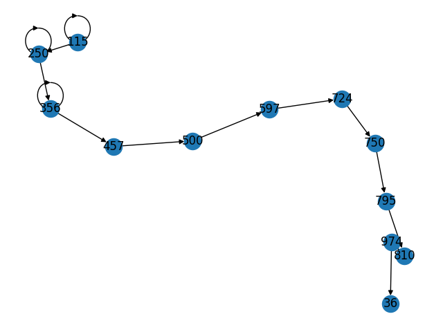
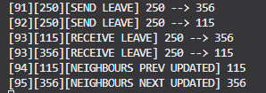

#  Distributed Network Simulation
Auteurs : HIPPOLITE Axel, RIBES Maël & WALLERAND Alex
<p align="center"> 
 
</p>
Ce projet est une simulation d'un système de réseau distribué. Il utilise la bibliothèque SimPy pour simuler le passage de messages à travers un réseau de nœuds.


## Installation 

Pour exécuter cette simulation, vous devez installer Python 3 et les bibliothèques SimPy et NetworkX. Vous pouvez les installer à l'aide de pip :
```bsh
pip install simpy networkx
```


## Usages
Pour lancer la simulation, il suffit d'exécuter le fichier *main.py*:

```bsh
python main.py
```
Il créera un réseau de trois nœuds. Il ajoutera ensuite d'autres nœuds au réseau, simulera le passage de messages d'insertions, puis supprimera l'un des nœuds du réseau.

Après avoir exécuté la simulation, un graphique du réseau sera affiché à l'aide de la bibliothèque [NetworkX](https://networkx.org/documentation/stable/tutorial.html).


## Introduction et objectifs

Dans ce projet, notre objectif a été d'implémenter une DHT en Python. Une Distributed Hash Table est une structure de données distribuée qui permet de stocker et de récupérer des informations de manière décentralisée.

Elle fonctionne en répartissant les données à travers un réseau d'ordinateurs connectés, appelés nœuds. Chaque nœud possède une partie de la table de hachage et est responsable d'une partie de l'espace de clés. 

Une clé est une chaîne de caractères qui est associée à une valeur, qui peut être une donnée, un fichier ou une autre information. Pour stocker une donnée dans la DHT, le nœud utilise une fonction de hachage pour calculer un identifiant unique à partir de la clé de cette donnée. Cet identifiant est ensuite utilisé pour déterminer le nœud responsable de stocker la donnée.

Afin de simuler les noeuds et leurs différentes interactions (envoie et réception de messages), nous avons utilisé la librairie [SimPy](https://simpy.readthedocs.io/en/latest/) pour simuler les délais de génération, de réception et de traitement des messages.


## Structure du projet

L'intérêt d'une DHT est de proposer une structure de données totalement décentralisée. Nous ne pouvons donc pas créer de serveur central permettant de gérer le système de noeuds et c'est là que réside la difficulté du projet. En effet, le réseau n'existe que grâce aux liens que les noeuds entretiennent avec leurs voisins respectifs. Le réseau n'est pas stocké dans une classe particulière et rien ne permet de le connaître globalement.

Le projet à donc une structure plutôt simple : un fichier *node.py* qui permet de définir les noeuds et leurs comportements, *message.py* qui constitue simplement la classe **Message** que les noeuds utilisent pour communiquer et *main.py* qui permet de lancer la simulation et d tester les fonctionnalités du projet.


## Fonctionnalités et choix effectués
### Rejoindre le réseau
Premièrement, un noeud qui souhaiterait rejoindre l'anneau du réseau, possède au départ pour voisin gauche et droite lui-même. Il contacte au hasard un des noeuds du réseau en lui communiquant son identifiant, pour que ce dernier puisse lui répondre s'il peut s'insérer ou non à sa droite. Si ce n'est pas possible, alors le noeud qui souhaite s'insérer va faire la même procédure avec le voisin suivant, jusqu'à trouver le bon emplacement. Une fois le bon emplacement trouvé, le noeud envoie un message de type *INSERT* à son contact, pour qu'il puissent chacun modifier correctement leurs voisins. Ainsi, on obtient un anneau de noeuds rangés par identifiant croissant : 
<p align="center"> 

</p>


### Quitter le réseau
Il est aussi possible pour un noeud de quitter le réseau, et donc de revenir à son état initial ou ses voisins sont lui mêmes. Il contacte ainsi ses voisins, en leur envoyant un message de type *LEAVE*, dont le contenu est le nouveau voisin auquel chacun des noeuds doit se connecter respectivement. Par exemple le noeud 250 souhaite se retirer de l'anneau : 
<p align="center"> 

</p>

### Stockage de données
Nous avons enfin mis en place la table de hachage distribuée. Chaque noeud possède un tableau de données, contenant des paires clés-valeurs. La clé est un hash et la valeur est un tuple contenant le titre et la donnée associée. Le hash est obtenu grâce à la fonction *hash* native de Python, dont on prend la valeur absolue et le modulo 1000, pour avoir une valeur semblable à nos identifiants de noeuds. A noter que la fonction de hash est randomisée, ce qui justifie les changements de valeur entre chaque exécution. Pour fixer une seed, il faut modifier la variable d'environnement *PYTHONHASHSEED*. Les noeuds stockent ainsi les données ayant les hash les plus proches de leurs identifiants. Avec l'implémentation actuelle, il est ainsi possible que 2 données possèdent le même hash, ce qui poserait des problèmes de collision.

Lorsqu'un noeud souhaite ajouter une donnée au réseau, il commence d'abord par hash la clé de sa donnée, puis va réutiliser la même méthode de recherche que pour l'insertion d'un noeud, mais par rapport au hash, puisque que l'on souhaite qu'une donnée, soit stockée dans le noeud de plus proche identifiant. Puis une fois le bon noeud trouver, le noeud porteur de la donnée envoie un message de type *PUT*, avec pour contenu, la donnée qui sera ainsi ajoutée par le noeud cible.

Si un noeud souhaite récupérer une donnée, on utilise ainsi le même principe que précédemment, et le noeud envoie un message de type *GET*, avec le hash de la clé de la donnée souhaitée. Il reçoit finalement en retour un message *DATA*, contenant la donnée demandée. Le noeud possédant la donnée effectuée une simple recherche dans sa table de hachage avec le hash reçu. 

### Logger et Graphes
Nous avons mis en place un système de log sous forme de prints dans la console. Chaque ligne de log affiche en premier le temps de la simulation, puis l'id du noeud ou le hash de la donnée, un message expliquant ce qui est en train de se passer puis éventuellement un commentaire. Ces logs ont été essentiels pour vérifier que tout se passait correctement dans la simulation et corriger les éventuelles erreurs.

Nous avons également utilisé la librairie [NetworkX](https://networkx.org/documentation/stable/tutorial.html) pour afficher de manière graphique la DHT. Cela nous permettait de vérifier plus rapidement que les noeuds s'ajoutaient bien dans le bon ordre par exemple.


## Difficultés et bugs
La principale difficulté que nous avons pu rencontrer lors de ce projet est de comprendre la simulation à événements discrets SimPy, et son fonctionnement. En effet, nous avons eu de nombreux problèmes de synchronisation de messages, notamment à cause des timeouts. En effet, pour simuler un des événements réels, nous utilisons les timeouts fournis par l'environnement SymPy, afin de faire avancer la simulation et montrer le temps que cela prend par exemple de générer un message. Nous avions ainsi au départ mis des valeurs random de timeout, ce qui nous a posé de nombreux soucis puisque certains messages arrivaient avant d'autres. Et du fait de la communication entre noeud qui se fait via un unique pipe, il pouvait arriver qu'un noeud récupère un message qui ne lui était pas destiné.


Par exemple, ici, lorsque nous avons voulu coder la fonctionnalité qui permet à un noeud de quitter l'anneau, on peut voir que les changements de voisins ne se faisaient pas correctement. Ceci peut être vérifié grâce aux logs ci-dessous, où l'on observe que lorsque 215 souhaite leave, le noeud 115 (précédant 250), reçoit le message destiné au noeud 356 (le noeud suivant 250).
<p align="center"> 


</p>

## Documentation

Voici une explication exhaustive du role des méthodes du code de *node.py*.

1. Constructeur :
    - ***init()*** : initialise un noeud avec un identifiant, une référence à son environnement de simulation (env), un canal de communication (pipe) pour envoyer et recevoir des messages, et une liste vide de messages. À sa création, un noeud est son propre voisin suivant et précédent en attendant qu'il rejoigne la DHT.

2. Setteurs :
    - ***set_next()*** : permet de définir le noeud suivant dans la DHT.

    - ***set_prev()*** : permet de définir le noeud précédent dans la DHT.

    - ***add_data()*** : permet d'ajouter une donnée à un noeud.

3. Ajout des noeuds à la DHT :
    - ***join()*** : est appelée lorsqu'un nouveau noeud souhaite rejoindre la DHT. Elle recherche d'abord le noeud de contact dans la DHT avec ***find()*** avant de lui envoyer un message d'insertion.

    - ***find()*** : est utilisée pour rechercher le contact d'un nouveau noeud dans la DHT en faisant en sorte que la DHT soit un cycle de noeuds classé par ordre croissant.

    - ***insert()*** : permet d'insérer un nouveau noeud dans la DHT en utilisant les références de noeuds voisins pour mettre à jour la DHT.

    - ***leave()*** : est appelée lorsqu'un noeud souhaite quitter la DHT. Elle envoie un message à chacun des voisin du noeud pour leur indiquer que celui-ci quitte la DHT. Elle utilise ensuite les setters pour supprimer les liens que le noeud avait avec ses voisins le faisant ainsi quitter la DHT.

    - ***nodes_rearrangement()*** : est appelée lorsqu'un noeud reçoit un message de suppression. Elle met à jour les références de noeuds voisins pour supprimer le noeud de la DHT.

4. Gestion des messages :
    - ***put()*** : est appelée lorsqu'un noeud souhaite ajouter une donnée à la DHT. Elle recherche d'abord le noeud où la donnée doit se placer avec la méthode ***find_node()*** avant de lui envoyer un message d'ajout de la donnée. 

    - ***get()*** : est appelée lorsqu'un noeud souhaite récupérer une donnée de la DHT. Elle recherche d'abord le noeud où la donnée est placée avec la méthode ***find_node()*** puis envoie un message de demande de la donnée au noeud.

    - ***find_node()*** : permet de trouver le noeud où la donnée doit s'ajouter. La donnée s'ajoute sur le noeud qui a l'id inférieur ou égal le plus proche du hash du titre de la donnée.

    - ***send_replicate()*** : permet d'envoyer un message d'ajout de la donnée aux voisins du noeud afin de la répliquer et d'avoir un taux de réplication égal à 3.
    
5. Gestion des messages :
    - ***message_generator()*** : est utilisée pour créer un message et l'envoyer à un autre nœud.

    - ***send()*** : envoie un message à un autre nœud en utilisant le canal de communication et appelle la méthode ***receive()*** du destinataire.

    - ***receive()*** : est appelée lorsqu'un noeud reçoit un message. Elle traite le message et le stocke dans la liste des messages du noeud.

    - ***run()*** : est la méthode principale qui gère le comportement du noeud dans l'environnement de simulation. Elle vérifie régulièrement la liste des messages et traite chaque message en conséquence en fonction de son type.
